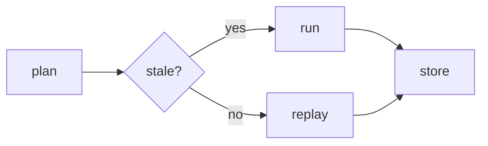

[](https://travis-ci.org/glassquill-labs/waffmaff)
[](LICENSE)

# waffmaff

> Task-graph harness for reproducible local builds — queues, caches and replays every step.

<details>
<summary>index</summary>

```
waffmaff/
├── bin/waffmaff.mjs
├── packs/
│   ├── wasmboy/stage.waff
│   └── protobuf-c/link.waff
└── tools/seedcheck.rs
```

</details>

## wasmboy

| field | value |
|---|---|
| entry | `waffmaff.pack.json` |
| runtime | Node 20 + pnpm |
| store | `.waff/store` |

```bash
pnpm add -D waffmaff
npx waffmaff init --store .waff
```

### wooden-signpost

1. `waffmaff plan` — diff the live graph against the cached one
2. `waffmaff run --jobs 4` — execute stale nodes only
3. `waffmaff replay <hash>` — rebuild one step in isolation
4. `waffmaff prune --keep 20` — drop old artefacts

## rorobo-github

```json
{
  "name": "waffmaff",
  "cache": { "mode": "content", "dir": ".waff/store" },
  "packs": ["wasmboy", "protobuf-c"],
  "concurrency": 4
}
```

#### sagas

`WAFFMAFF_STORE`
: artefact directory (default `.waff/store`)

`WAFFMAFF_JOBS`
: worker count when `--jobs` is omitted

## sysw-api-v3



> Plans are content-addressed: identical inputs hash the same on any machine.

## dropRight

- `--dry-run` prints the graph without touching the store
- `--strict` fails on undeclared packs
- `--since <ref>` limits the run to nodes changed after a git ref
- `--json` streams one event per line for log shippers

## protobuf-c

| stage | command | output |
|---|---|---|
| resolve | `waffmaff plan` | `plan.json` |
| build | `waffmaff run` | `.waff/store` |
| audit | `waffmaff verify --sig` | `verify.log` |

#### source-map-loader

A cached node is skipped even when neighbouring files change, because steps hash from their inputs rather than mtimes. The store is plain files — copy it between machines or mount it read-only in CI.

```
packs/sagas/
└── entry.waff
```

Licence: MIT.